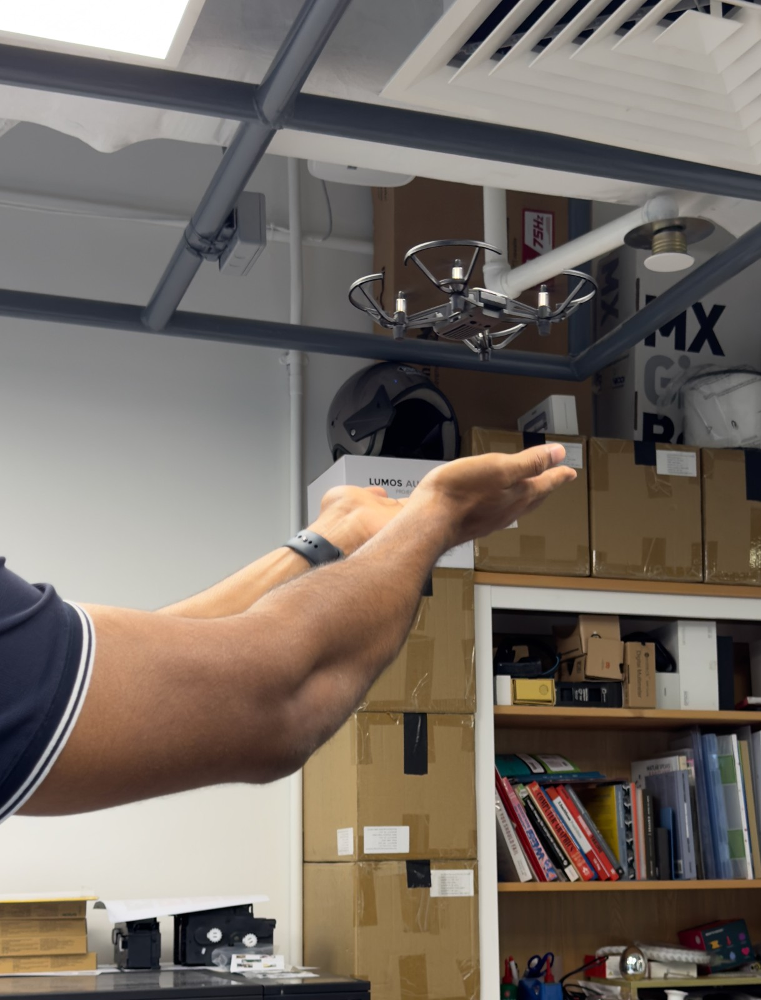

  

# CNRS-IPAL+AHLab Assistive Drone Projects

A curated collection of research code, experiments, and demo tools for assistive drone interaction.

This organization brings together work from the Drone Buddy ecosystem, including reusable library components, workspace-level experiments, ROS/mobile integrations, and supporting prototypes.

## Main Repositories

### DroneBuddy-Workspace

The primary workspace for running Drone Buddy experiments, demos, and integration scenarios.

_Status: currently private while being organized for release._

### Drone-Buddy-Library

Reusable components for drone control, perception, interaction, and assistant workflows.

_Status: currently private while being organized for release._

## Supporting Work

The public repositories in this organization preserve smaller experiments and integration pieces around the Drone Buddy project, including live camera feedback, Wi-Fi testing, ROS support, and demo prototypes.

As the project materials are curated, this page will continue to link the core workspace, reusable library, and supporting repositories into a clearer research archive.

## Acknowledgments

This organization curates work developed across contributions from three project members. The goal is to preserve, organize, and document the different parts of the Drone Buddy ecosystem so they are easier to understand, reuse, and extend.

We gratefully acknowledge the original development, experiments, and project materials contributed across the repositories.
